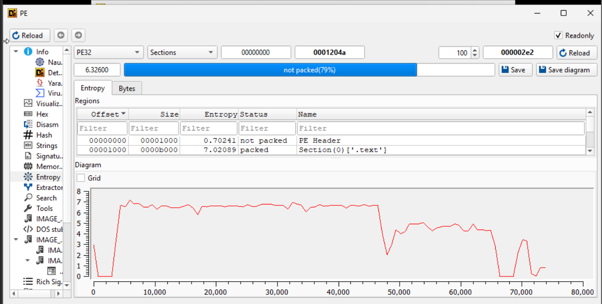

-   Detect it easy downloaded through github

    -   

-   First we will be looking at the not packed file:

    -   

    -   By clicking on signatures we get this:

    -   

    -   By clicking on advanced \> entropy we get this:

    -   

    -   Analyzing this we can see that,

        -   the file type is an executable here (PE32 top left).

        -   The file is not packed (as shown in the signatures)

        -   The file has low relatively low entropy which means that it
            is not packed (avg entropy: 6.326, anything above 7.5 means
            it is most likely packed)

-   Now looking at the packed file

-   Download UPX from github latest release and unzip it

-   went into the directory of where I downloaded UPX

-   unpacked the packed file with UPX

    -   

    -   We can see that the ratio is 65.28% and the format is of
        win32/pe

-   Let\'s look at it inside of DIE

    -   

    -   Unfortunately, I was not able to look at the packed file before
        I unpacked it. However, looking at the entropy levels we do get
        a higher level than when we looked at the unpacked version.

**Final key conclusions**

-   **Packing obfuscates executables by compressing sections, increasing
    entropy, and making static analysis harder.**

-   **Detect It Easy (DIE) can identify packers, but sometimes packer
    signatures may be missing due to signature stripping or
    modification.**

-   **Entropy analysis is a key technique in determining whether a file
    is packed, with high entropy suggesting compression or encryption.**

-   **UPX is a common packer, and unpacking with upx -d successfully
    restores the original executable.**

-   **Static analysis tools and antivirus software often flag packed
    executables as suspicious, even when they are harmless.**
testing
